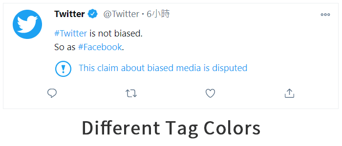
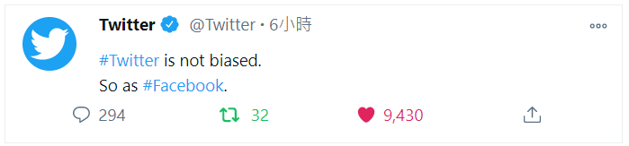
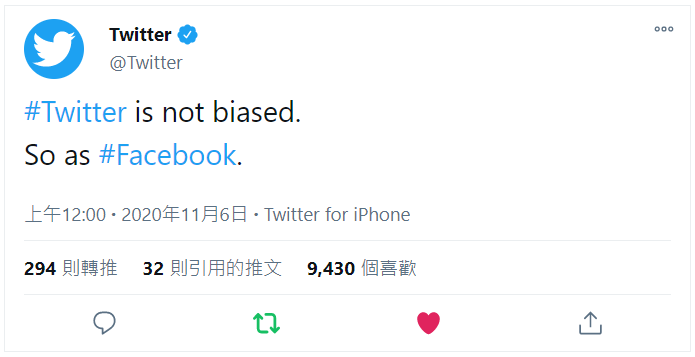
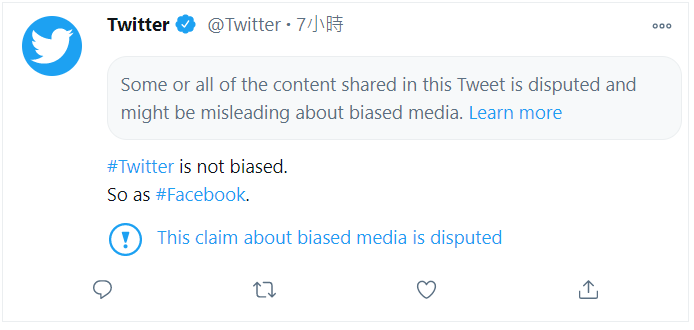

# Tweet Simulator
A React component of advanced tweet generator.

Live [demo](https://demching.github.io/tweet-simulator/)

## Intro

This simulator allows you to generate a tweet in these ways:

1. `3` different themes: `default`, `dim` and `light out`
2. `6` colors for user tags, hashtags or links
3. `5` different languages: `English`, `Japanese (日本語)`, `Korean (한국어)`, `Traditional Chinese (繁體中文)` and `Simplified Chinese (简体中文)`
4. `2` different modes: `brief tweet` and `complete tweet`

Brief Tweet:

Complete Tweet:

5. `2` different notices: `warning` and `notice`
